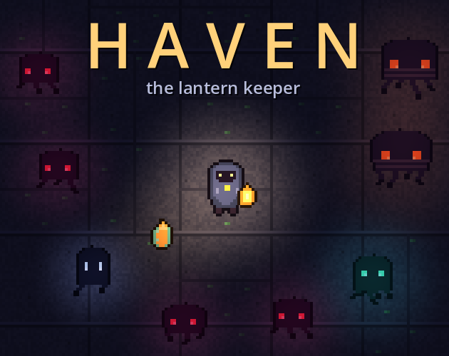
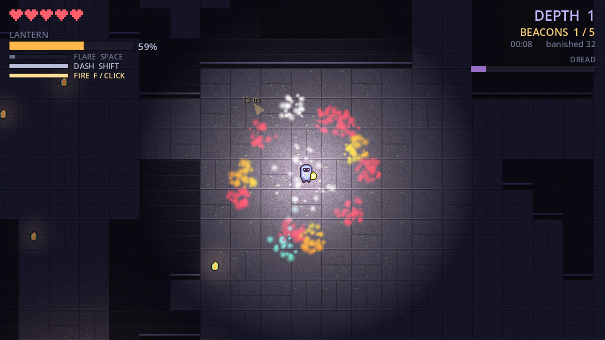
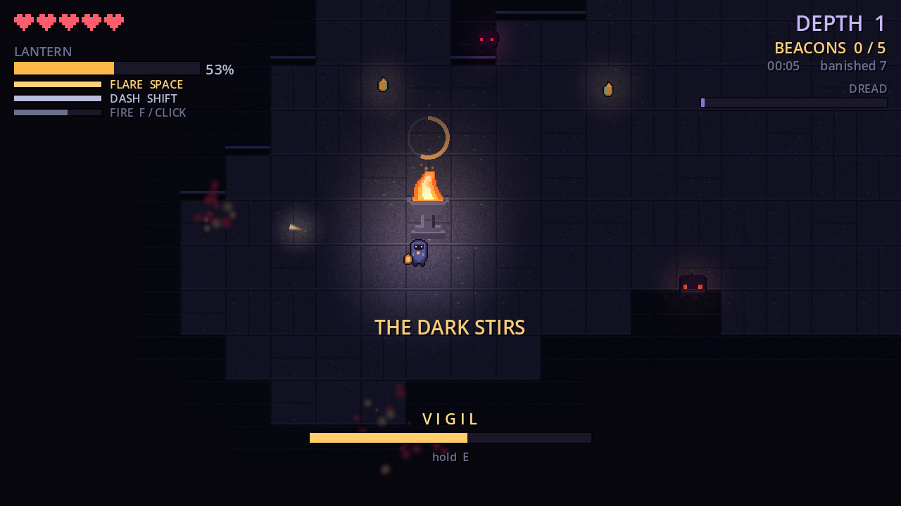
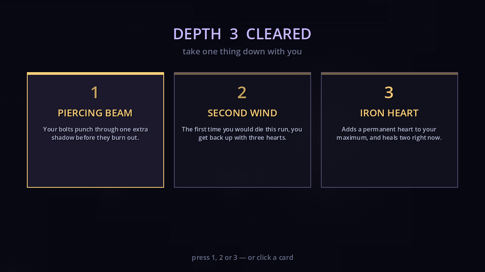
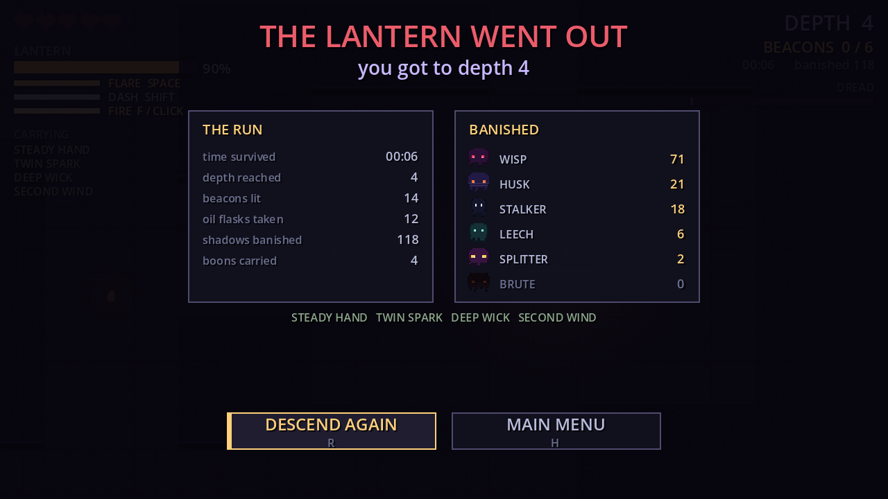
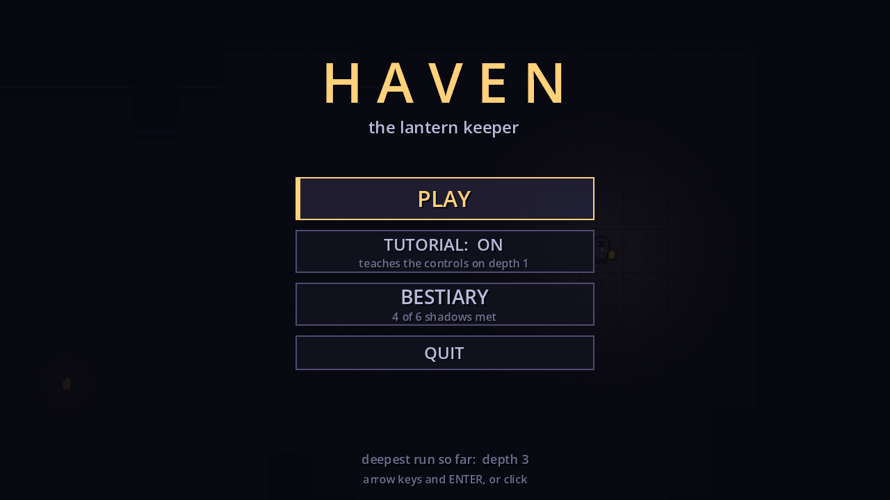
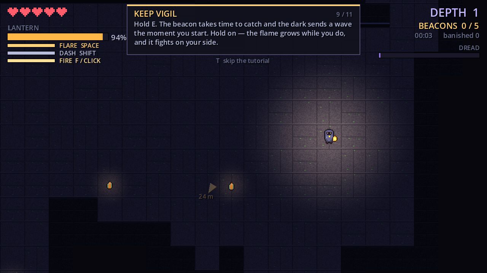
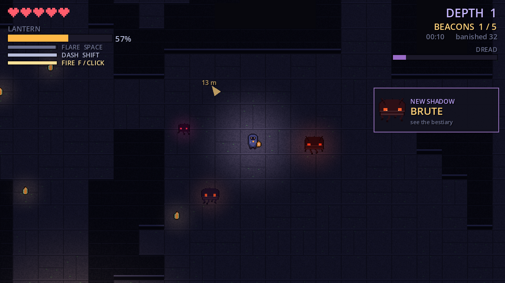
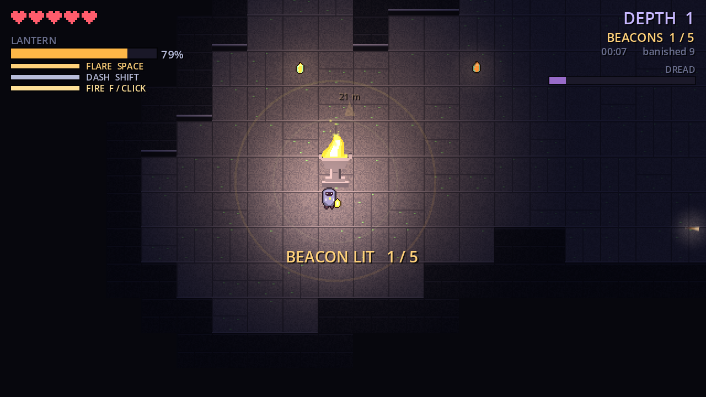

<p align="center">
  
</p>

<p align="center">
  <b>Explore the ruins, light up the beacons, and build your own little haven before the monsters notice your lantern is running on fumes.</b>
</p>

<p align="center">
  <a href="https://bomberman1359.itch.io/haven"></a>
  
  <a href="LICENSE"></a>
</p>

# Haven: the lantern keeper

A top-down 2D roguelike made in Godot 4.7. You carry the last lantern in a ruin
that goes down forever, and every shadow down there would like that lantern to
go out.

**[Play it in your browser on itch.io](https://bomberman1359.itch.io/haven).**
No install, no account.



## The idea

The lantern burns fuel every second, and the size of your light is however much
fuel you have left. Shadows walk straight through walls, so there is no hiding
behind a pillar and no corner to cheese. The light is the only thing they
respect.

Light every beacon on a floor and a stairway opens. Take it, pick a boon, and do
the whole thing again one floor down. There is no bottom. Your score is how deep
you got before the dark caught up with you.

## Running it

The quick way is [itch.io](https://bomberman1359.itch.io/haven), right in the
browser.

To run it from source, open this folder in Godot 4.7 and press play. There is
nothing else to install. The repo also ships a Web export preset, so
Project > Export > Web builds the same browser version that is on itch.

## Controls

| key | action |
| --- | --- |
| WASD / arrows | move |
| F or left click | fire a bolt of light at the nearest shadow (2.5 fuel) |
| SHIFT | dash (5 fuel, nothing can hit you mid-dash) |
| SPACE | flare, heavy damage in a radius (35 fuel) |
| E | hold at a beacon to keep vigil |
| 1 2 3 | choose a boon between floors |
| T | skip the tutorial |
| R | run again from the death screen |
| H | back to the main menu |
| ESC | menu, or quit from the menu (the browser version skips the quitting part) |

The arrow near the middle of the screen points at the nearest dead beacon. It
turns blue and points at the stairway once the floor is clear.

## Firing

Bolts aim themselves. They fly at whichever shadow is nearest within 300 px,
or straight ahead if the room is empty. One bolt kills a wisp on the first
floor, a husk takes two, a brute takes eleven. A bolt counts as lantern light,
so a splitter still comes apart when one kills it and a brute still shrugs half
of it off. Only a flare kills either of those outright.

## The vigil

A beacon does not just switch on. Holding E starts a vigil: the beacon takes
several seconds to catch, and the dark answers the moment you begin by sending
a wave at you. Let go, or get knocked out of range, and the charge bleeds back
out.

The half-lit brazier lights up as you hold it, so the ground gets safer the
longer you last. Finishing one refunds a chunk of fuel, scours every shadow
nearby, and leaves that corner of the map permanently safe. That corner is your
haven. Enjoy it, because the stairs are somewhere else.

Each beacon on a floor takes longer than the last, and so does each floor.



## What is down there

| | |
| --- | --- |
| **Wisp** | The basic thing. Light burns it, flares delete it. It never shows up alone. |
| **Husk** | Twice the health, and it walks into the glare instead of backing off. Rude. |
| **Stalker** | Sprints in the dark and freezes the moment your light touches it. The light never actually hurts it, so do not get comfy. |
| **Leech** | Never touches you. Hangs at the edge of your reach and drinks the lantern through a very long straw. |
| **Splitter** | Kill it with light and you get two wisps for the price of one. Only a flare kills it clean. |
| **Brute** | Immune to lantern light. Two flares, or take the long way around. |

Wisps and husks are there from the first floor. Stalkers show up at depth 2,
leeches at 3, splitters at 4, brutes at 5.


## Dread and depth

Two separate pressures.

**Dread** is how bad the current floor has got. It climbs with time spent here
and with every beacon you light, and it drives spawn rate, fuel burn and how
dark the ruin renders. It resets when you go down.

**Depth** never resets. Each floor is bigger, holds more beacons, and multiplies
shadow speed and health. Together they are unbounded, so there is always a floor
that finally gets you.

## Boons

Clearing a floor lets you take one of three things down with you, drawn from
eighteen: a slower burn, a wider light, a bigger tank, richer flasks, a light
that burns faster, a cheaper flare, cheaper and faster bolts, a second bolt per
shot, bolts that pierce, another heart, a longer mercy window, a one-time
revive, faster boots, a burning dash trail, stronger beacons, beacons that
refuel you further out, fuel drops from banished shadows, or brighter ambient
light. Six of them can be taken more than once, and they stack across the run.



## The tutorial, the menu, the bestiary

Depth 1 runs an eleven-step tutorial that introduces one control or one HUD bar
at a time and waits until you actually do the thing before moving on. T skips
it, and the main menu has a TUTORIAL: ON / OFF toggle.

The bestiary starts empty. Every shadow you meet for the first time slides in a
NEW SHADOW card and unlocks its entry: what it is, and how to handle it. Locked
entries show a silhouette. It is saved along with your
deepest run, so it survives between sessions.

Dying opens a stats page with your time, depth, beacons lit, flasks taken,
boons carried, and a per-kind count of everything you banished. It is mostly
there so you know exactly who to blame.



## More screenshots

<table>
  <tr>
	<td></td>
	<td></td>
  </tr>
  <tr>
	<td></td>
	<td></td>
  </tr>
</table>

## How it is put together

```
src/
  core/      game.gd is the hub: map generation, depth and dread, spawning, FX
			 hud.gd draws every screen and rebuilds its buttons as it draws them,
			   so the keyboard and the mouse always agree on what is where
			 terrain.gd draws the ruin in one pass
			 sfx.gd is an autoload: pooled one-shots plus the looping music
  player/    the player, the lantern, and the bolts it fires
  shadows/   all six kinds in one script, driven by a stats table
  world/     beacon.gd owns the vigil; flasks and the stairway live here too
assets/
  sprites/   every png, made by tools/gen_sprites.py
  audio/     every wav, made by tools/gen_audio.py
docs/        screenshots for this readme
tools/       the two generator scripts
```

A few notes on the implementation:

- Each floor is generated fresh. Rooms are placed with rejection sampling and
  chained with L-corridors, then shortcut loops and alcoves are carved so
  nothing looks like a grid of boxes.
- Only wall tiles that touch open floor get a collider, and each row of those
  is merged into one horizontal run. That turns roughly 900 tiles into a couple
  hundred static bodies, with matching light occluders so the lantern casts
  real shadows.
- Shadows have no pathfinding at all. They ignore walls by design, which
  removes navmesh work and makes the light the actual mechanic.
- Every shadow kind lives in one script driven by a stats table, including how
  fast light burns it and how hard light shoves it back. A husk has a low push
  value, which is why it walks into your face.

## Regenerating the art

```
python3 tools/gen_sprites.py
python3 tools/gen_audio.py
```

They write into `assets/sprites/` and `assets/audio/`, and Godot reimports them
the next time the editor gets focus. Pillow is the only dependency, and the
audio script uses the standard library alone.

## License

MIT, see [LICENSE](LICENSE). Take it apart and build something weirder with it.
